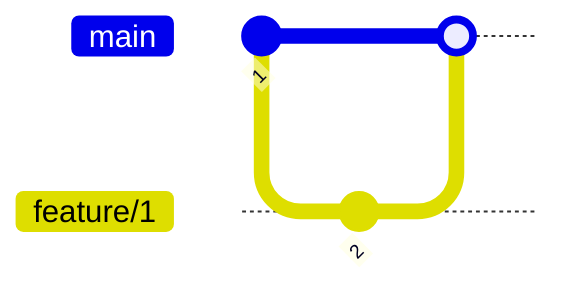
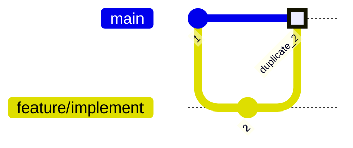
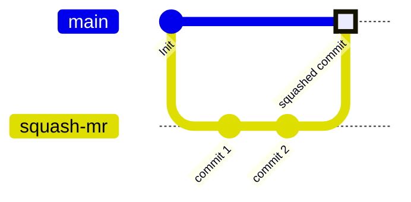
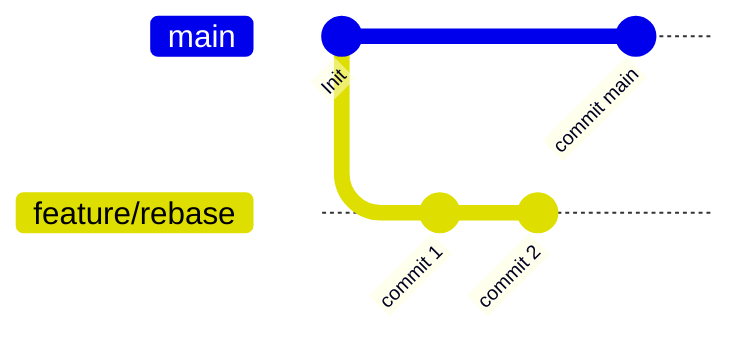
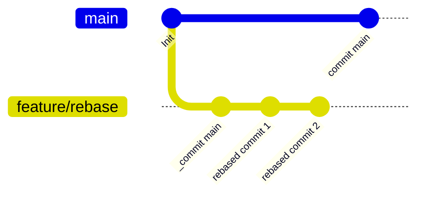
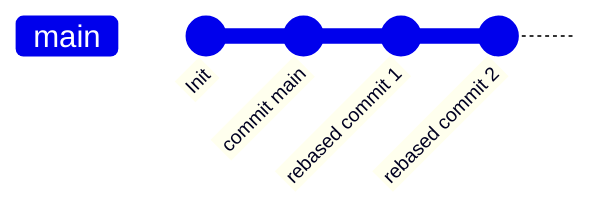

---

# Git: Merges / rebasing

<v-switch>
<template #1>
A Pull-Request is the process of raising awareness about a merge from a branch to a target branch, such as a feature branch to main.  
The Pull-Request facilitates things like discussions, change requests to edits, diff views, approvals etc - more on this later.

But most importantly it facilitates what happens when a Pull-Request is completed
</template>

<template #2>
There exists different methods of completing a Pull-Request;

1. No fast-forward
1. Fast-forward
1. Squash commit
1. Rebase with fast-forward or merge commit

</template>

<template #3>

**No fast-forward** is the method of not rewriting history and simply adding on top of the target branch.

</template>

<template #4>

**Fast-forward** is the method of rewriting target branch to represent a linear history of events. In below graph you see a merge where the merged point is highlighted and represent a duplicate of the commit with id 2 that happened on the feature branch. If a git log is correctly drawn after the impact of the merge, the branch `feature/implement` will no longer be present in the git history.

</template>

<template #5>

**Squash commit** is the method of squashing all your commits that happened on the feature branch to a single commit on the target. This method is much like fast-forward in the sense that the existence of the feature branch will be gone in relation to the history after the merge is complete. This method creates a very clean linear git history.

</template>

<template #6>

**Rebase** A rebase strategy works a in a sense reverse to how regular merges does. Instead of adding on top of the target branch, rebase takes each commit on the feature branch and merges one by one with the differences that happened on main since the feature branch got created.

</template>

<template #7>
Rebase
 

</template>

<template #8>
Rebase and merge
 

</template>

<template #9>

For more information on read the following topics;

1. [Merging vs Rebasing](https://www.atlassian.com/git/tutorials/merging-vs-rebasing#:~:text=Integrating%20an%20approved%20feature&text=However%2C%20by%20performing%20a%20rebase,added%20during%20a%20pull%20request.)
1. [Git merge](https://www.atlassian.com/git/tutorials/using-branches/git-merge)

</template>

</v-switch>

---