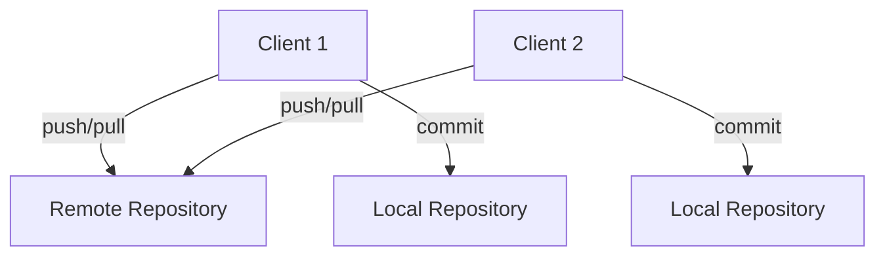
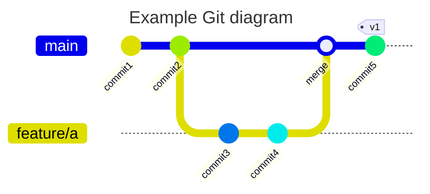
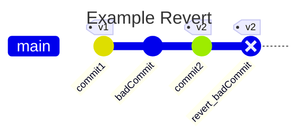
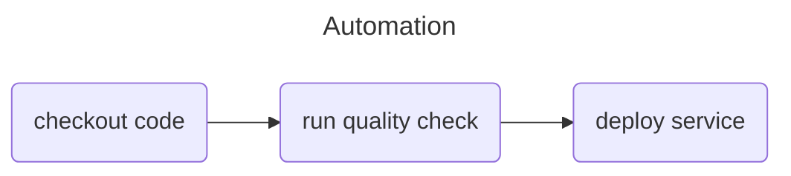

---
# You can also start simply with 'default'
theme: seriph
# random image from a curated Unsplash collection by Anthony
# like them? see https://unsplash.com/collections/94734566/slidev
background: MFT_background_1.png
# some information about your slides (markdown enabled)
title: Welcome to Slidev
# apply unocss classes to the current slide
class: text-center
# https://sli.dev/features/drawing
drawings:
  persist: false
# slide transition: https://sli.dev/guide/animations.html#slide-transitions
transition: slide-left
# enable MDC Syntax: https://sli.dev/features/mdc
mdc: true
line-numbers: true
---

# Welcome to *Git*ting comfortable

A short introduction to Git

<div class="pt-12">
  <span @click="$slidev.nav.next" class="px-2 py-1 rounded cursor-pointer" hover="bg-white bg-opacity-10">
    Press Space or use keyboard arrows for next page <carbon:arrow-right class="inline"/>
  </span>
</div>

---

# What is git?

If you are completly new to git, then see the below video. If you know the basics, then continue onwards with the slides.

<div align="center"><iframe width="560" height="315" src="https://www.youtube.com/embed/e9lnsKot_SQ?si=2DrFSwuNl1jmYsN-" title="YouTube video player" frameborder="0" allow="accelerometer; autoplay; clipboard-write; encrypted-media; gyroscope; picture-in-picture; web-share" referrerpolicy="strict-origin-when-cross-origin" allowfullscreen></iframe></div>

---

# Format of the slides

In the upcomming slides we will go through;

* Basics of Git
* Why Git?
* Git: Push/Pull
* Git: branches
* Git: Merges / rebasing
* Git: Merge conflicts
* Git: Revert / reset
* Git: Stash
* Git: Pull-Request

The section noted with "Git: ..." will follow a structure of _introduction_ -> _video_ -> (_theory_ - if needed) -> _wrap-up_

---

# Basics of Git

Git is a version control system that helps you manage text files of all sorts in a collaborative and structured manner.

The concept of git is that you work with a _repository_ of which you can create _branches_ (think shortlived variants of the codebase) that enables you to collaborate from the same point in time. You use `commit` to move code changes into the _staging area_. This creates a record of your change for others and yourself to keep track of the history of a branch.
At the end you sync changes to a git server with `push` in order to save work and synchronize changes with your colleagues or automation systems.

```bash
# Add a file to "staging"
git add <file>

# Records all changes that are staged by add with documentation on the work 
# done in the files
git commit -m <message>

# Push all missing commits from localhost (your machine) to a git server 
# syncing your records with a server for collaboration
git push -u origin <branch>

# Create and switch branch in a single command
git checkout -b <branch>
```

---
layout: two-cols
---

# Basics of Git: Client-server

Git works as a client server paradigm 
<br>
<br>

Git works by a client (a user) cloning the source code from a _repository_, performing edits locally and pushing these edits to _origin_ (the server from which you downloaded the source code). <br><br>
The benefit is here, that you can have multiple clients each with their own cloned repository, working on the same repo at the same time and continuously pushing code to origin.

::right::

<br>
<br>
<br>
<br>
<br>



---
layout: two-cols-header
---

# Why Git?

Selling points:

::left::

- Multiple collaborators
 - 4 eyes principle

<br>
<br>

<div v-click>

*Joe; I like your change +1*

</div>

<arrow v-click at=5 x1="250" y1="400" x2="550" y2="450" color="#953" width="2" arrowSize="1" />

::right::
<div v-click> 

Git is an collaborative development solution that versions your code enabling multiple collaborators and pair-review processes built into the methodology.


```diff
public class Hello1
{
   public static void Main()
   {
-      System.Console.WriteLine("Hello, World!");
+      System.Console.WriteLine("Rock all night long!");
   }
}
```  
</div>

---
layout: two-cols-header
---

# Why Git?

Selling points:

::left::


- Change history
  - Compliance
  - Reverting is easy
  - Versioning


::right::
<div v-click>

</div v-click>

<div v-click at=2>

</div v-click>

---
layout:  two-cols-header
---

# Why Git?

Selling points:

::left::

<div >

- Automation
  - Quality check
  - Deployment

</div>


::right::

<v-click>

Another benefit of Git is that we can integrate the version control with <span v-mark.circle.orange="1">automation tooling</span> which continuously <span v-mark.circle.red="1">quality checks</span> your code.

</v-click>

<v-click at=2>

</v-click>

---

# Git: Push / Pull - introduction

In the upcoming section we will dive into the basics of git, but in order for you to have the best experience learning these concepts we need to introduce `git push` and `git pull`.

When you have changes (_commits_) that others could be interested in, you should run `git push`.
This takes everything you have committed on the active branch and moves those changes to origin.
Similarly, you should regularly run `git pull` to synchronize your local repository with what others have pushed to origin.

Useful commands:

* `git push origin` - will push changes to origin for the current checked out branch
* `git pull origin` - will pull changes from origin for the current checked out branch

---

# Git: Branches - introduction

Git _branches_ is a requirement of git. _Branches_ are effectively a pointer to a snapshot of your changes, they keep track of increments in commits, and you have multiple long or short-lived _branches_ where when you combine branches with a `merge`, the origin of the _from_ branch can be deleted.

Useful commands:

* `git branch -a` - will display all available branches both remote and local
* `git branch name` - will create _name_ as a branch
* `git checkout name` - will switch to newly created branch _name_
* `git checkout -b featurebranch` - will create branch _featurebranch_ and switch to it, all in one command.

---

# Git: Branches - video

<br>
<br>

<div align="center"><iframe width="560" height="315" src="https://www.youtube.com/embed/hwP7WQkmECE?si=klWPkP_ihdEghSNk&amp;start=68" title="YouTube video player" frameborder="0" allow="accelerometer; autoplay; clipboard-write; encrypted-media; gyroscope; picture-in-picture; web-share" referrerpolicy="strict-origin-when-cross-origin" allowfullscreen></iframe></div>

---

# Git: Branches

Branches in git is the foundation for encapsuling commits in a historic manner. Branches are made for merging in relation to a _base_ branch often named as _main_ or _master_. In the following text we assume _main_, as the default branch.

When a change has been completed on a branch it is ready to be included in _main_. Combining two branches is referred to a *merging*. 
Before we dive into *how* to do it, it is important to talk about *when*. 

Ideally are branches short lived.
This means that we should strive to get meaningful changes merged back into _main_ as quickly as possible.
A good rule of thumb is that branches should not live for more than two days.
In reality, this can be difficult to always do, but it is a good compass, none the less. 


---

# Git: Branches - recap

In previous sections you learned about git _branches_, which to git is the basis for simultaneous work done safely on the same code base. It can be used to do increments on repositories and then `merge` your branch into other branches in order to synchronize your changes with other peers.

The most notable commands to remember from branches are:

```bash
# list local branches
git branch

# list remote branches
git branch -r

# checkout a branch
git chechout <branch-name >

# create and checkout a new branch
git chechout -b <branch-name >
```
---

# Git: Merge / rebase - introduction

Git `merge` or `rebase` is an operation of combining the content of two branches. It is mostly used locally when you branch out of your _main_ branch and want to `merge` _main_ into your feature branch in order to get the latest revision of changes from main. A `merge` is also used when going from a feature branch to _main_ but this is often facilitated by a _Pull-Request_ which we will go over in later chapters.

Useful commands:

```bash
# when a feature branch is checked out, then this command will merge the  current _local_ changes of 
# main into your current checked out branch.
git merge origin/main
# this is a combination command that will first pull changes from `origin main` and then merge these 
# changes to your current checked out branch.
git pull origin/main 
# this will do a rebase of current branch based on `origin main`.
git rebase origin/main
```

[Git merge strategies](https://git-scm.com/docs/merge-strategies) - explains different merge strategies that can be applied to `git merge`.

---

# Git: Merge / rebase - video

<br>
<br>

<div align="center"><iframe width="560" height="315" src="https://www.youtube.com/embed/0chZFIZLR_0?si=wXEsqrpC528IVvkj" title="YouTube video player" frameborder="0" allow="accelerometer; autoplay; clipboard-write; encrypted-media; gyroscope; picture-in-picture; web-share" referrerpolicy="strict-origin-when-cross-origin" allowfullscreen></iframe></div>

---

# Git: Merge / rebasing - recap

In previous section you learned about git `merge` and `rebase` which are both methods of combining content between two branches. They are similar in usage, but function differently in how the history will turn out for the two operations. We use `merge` or `rebase` locally when we want to pull new changes from _main_ into our feature branch or when we want to combine two local branches.

The most notable commands to remember are:

* `git merge`
* `git rebase`
* `git pull origin main`

---

# Git: Merge conflicts - introduction

_Merge conflicts_ are a concept in git that exists due to it by nature is a version control tool, that allows simultaneous client that can change the same files, sometimes on the same line-number, and if they then try and merge with eachother or both towards _main_ they will experience the concept of _merge conflicts_. The existence of merge conflicts are due to the server not knowing which changes on the same line-number should be the truth, or if both has the be truth - so you as a client have to help it make that decision by _fixing the merge conflict_.

There are not really any useful commands for when you need to handle a merge conflict, but there is one general recommendation;

* _Make use of an IDE to help you represent a merge conflict_. By default git will create a syntax highligting consisting of `>` and `<` characters to notate the two decision points on any given line/lines that represents the merge conflict. Making sense of these notations can be hard without a vision representation on top, such as vscode, Visual Studio, Idea IDE, Rider etc.

---

# Git: Merge conflict - video

<br>
<br>

<div align="center"><iframe width="560" height="315" src="https://www.youtube.com/embed/Sqsz1-o7nXk?si=-vQfv2kamrGYfnf4&amp;start=68" title="YouTube video player" frameborder="0" allow="accelerometer; autoplay; clipboard-write; encrypted-media; gyroscope; picture-in-picture; web-share" referrerpolicy="strict-origin-when-cross-origin" allowfullscreen></iframe></div>

---

# Git: Merge conflicts - recap

In previous section you learned about _merge conflicts_ in git. Merge conflicts is when git does not know the truth about how to handle two changes in the same file on the same line. The conflict is always a result of either a `merge` with another branch that contains edits on the same line in the same file as you have on your current branch.

The key takeaway of this section is that _merge conflicts_ can be a pain to work with, but is necessary for git to have as a concept, and without a UI tool, merge conflicts can be challenging to deal with.

---

# Git: Revert / reset - introduction

Git `revert` or `reset` function differently, but they are often used with the same basic need; undoing something committed and/or pushed to origin. `Revert` works on a single or multiple commits that you want to reverse. `Reset` works on a single or multiple commits/staged changes that you want to unstage/uncommit in order to either reverse them or change in order to stage/commit again.

Useful commands:

```bash
# Reset the current changes with the one commit on HEAD of the branch. The changes will end up unstaged.
git reset HEAD~1 

# The --soft flag stages the changes instead of leaving them unstaged.
git reset --soft HEAD~1 

# The --hard flag completely undoes the changes.
git reset --hard HEAD~1 

# Create a new commit that reverts the content of the specified commit.
git revert <commit-id> 
```
---

# Git: Revert / reset - video

<br>
<br>

<div align="center"><iframe width="560" height="315" src="https://www.youtube.com/embed/H2DuJNWbqLw?si=Ltw_X87fbonFOsqe" title="YouTube video player" frameborder="0" allow="accelerometer; autoplay; clipboard-write; encrypted-media; gyroscope; picture-in-picture; web-share" referrerpolicy="strict-origin-when-cross-origin" allowfullscreen></iframe></div>

---

# Git: Revert / Reset - recap

In previous section you learned about git `revert` and `reset`, which both are two commands for undoing commits in git. `Revert` will undo commit(s) by creating a new commit with the undoing of the changes. This is useful for changed that are already pushed to origin.
`reset` will "uncommit" or entirely erase committed changes based on strategy, which is the go-to approach on changes not yet pushed.

The most notable commands to remember are:

* `git reset --soft HEAD~1` # for undoing the latest commit but keeping the changes staged
* `git revert HEAD~1` # make a new commit that undo the last commit
* `git revert <commit-id>` # make a new commit that undo all changes after a specific commit

---

# Git: Stash - introduction

Git `stash` is a command that moves your changes to a local storage. It can help you save work that you do not yet know where to commit. It can also be used to move changes from one branch to another without having to commit them. git will prohibit you from doing checkout out on a branch with uncommitted changes. This is where `git stash` comes in handy, since you can save work, checkout another branch, and apply the changes from the stash.

The following video will explain how to do this.

---

# Git: Stash - video

<br>
<br>

<div align="center"><iframe width="560" height="315" src="https://www.youtube.com/embed/lH3ZkwbVp5E?si=z4V07VS_zoSn5Qb0" title="YouTube video player" frameborder="0" allow="accelerometer; autoplay; clipboard-write; encrypted-media; gyroscope; picture-in-picture; web-share" referrerpolicy="strict-origin-when-cross-origin" allowfullscreen></iframe></div>

---

# Git: Stash - recap

In previous section you learned about git `stash` which is a queue that can contain changes without being tied to a branch. Git `stash` is useful for saving and moving work that was unintentional made on a branch where it shouldn't have been made. Git `stash` works as a LIFO queue, meaning when you add something to the queue it will be the top item in the queue, and thereby the first being removed from the queue upon `pop`.

The most notable commands to remember are:

* `git stash`
* `git stash pop`

---

# Git: Pull-Request - introduction

A git _Pull-Request_ is a server side operation (GitHub, Azure DevOps, Bitbucket etc) of facilitating a merge between two branches. A _Pull-Request_ differs a lot servers between, but generally they all contain functionality like;

* Viewing diff view of changes _from_ branch _to_ branch
* _Assignee_ and _Reviewer_
* Comment threads
* Approvals, rejections and suggestions
* Merge with support for different strategies

---
layout: image-right
image: /PR_view.png
backgroundSize: 80%
---

# Git: Pull-Request

On the right hand-side you see a screenshot of how a Pull-Request looks like in GitHub. Note the numbers marked on the image in different sections.

<v-switch>

  <template #1> 1. This is the reviewer section who is in charge of reviewing code </template>
  <template #2> 2. The assignee section who is in charge of dealing with the reviewed code and the merge. This is usually the raiser of the Pull-Request </template>
  <template #3> 3. This is where you "complete" the Pull-Request by merging it </template>
  <template #4> 4. Here you can write comments and make comment threads addressing issues, reviews etc. </template>
  <template #5> 5. This is the event view in historical order of what happened. Comments and reviews will appear here in chronological order </template>
  <template #6> 6. This tab switches the view of Pull-Request between the "conversation" view (as you see on the screenshot), "commits", "checks" (pipelines) and "Files changed" (git diff view) </template>
  <template #7> 7. This is the description of the Pull-Request where you as the creator of the Pull-Request document the intent of the Pull-Request </template>
  <template #8> 8. Finally the title of the Pull-Request </template>

</v-switch>
---

# Git: Pull-Request - recap

In previous section you learned about Pull-Requests for git, which is a server-side technology that facilitates a merge between two branches.
A Pull-Request is the foundation of collaboration for git, since it is the place where you can raise awareness of your edits and get input on them.

With a Pull-Request you get functionality like;
* _assignee_ & _reviewers_
* _commit threads_
* _approvals/rejections/suggestions_
* and more.

---

# Time to do exercises!


- In the repo; https://github.com/mftenergy/Gitting-comfortable there are exercises
- Follow the path explained at https://github.com/mftenergy/Gitting-comfortable?tab=readme-ov-file#suggested-learning-path
- Path into an exercise directory, run `setup.sh` and read the README.md for instruction on what to do

```bash
cd basic-commits
./setup.sh
cat README.md
git magic
```

NOTE: There is a [cheatsheet](https://github.com/mftenergy/Gitting-comfortable?tab=readme-ov-file#cheatsheet) at the bottom of the README.md in the root of the repository.

You have two option;

1. **recommended** [Run in google cloud spaces (free)](https://console.cloud.google.com/cloudshell/editor?cloudshell_git_repo=https://github.com/mftenergy/git-course.git)
1. Run everything locally, if you choose that then read: [https://github.com/mftenergy/Gitting-comfortable/blob/main/setup-git/README.md](setup-git)
