---
# You can also start simply with 'default'
theme: seriph
# random image from a curated Unsplash collection by Anthony
# like them? see https://unsplash.com/collections/94734566/slidev
background: /MFT_background_1.png
# some information about your slides (markdown enabled)
title: Welcome to Slidev
# apply unocss classes to the current slide
class: text-center
# https://sli.dev/features/drawing
drawings:
  persist: false
# slide transition: https://sli.dev/guide/animations.html#slide-transitions
transition: slide-left
# enable MDC Syntax: https://sli.dev/features/mdc
mdc: true
line-numbers: true
---

# Welcome to *Git*ting comfortable

A short introduction to Git

<div class="pt-12">
  <span @click="$slidev.nav.next" class="px-2 py-1 rounded cursor-pointer" hover="bg-white bg-opacity-10">
    Press Space or use keyboard arrows for next page <carbon:arrow-right class="inline"/>
  </span>
</div>

---

# What is git?

If you are completly new to git, then see the below video. If you know the basics, then continue onwards with the slides.

<div align="center"><iframe width="560" height="315" src="https://www.youtube.com/embed/e9lnsKot_SQ?si=2DrFSwuNl1jmYsN-" title="YouTube video player" frameborder="0" allow="accelerometer; autoplay; clipboard-write; encrypted-media; gyroscope; picture-in-picture; web-share" referrerpolicy="strict-origin-when-cross-origin" allowfullscreen></iframe></div>

---

# Format of the slides

In the upcomming slides we will go through;

* Basics of Git
* Why Git?
* Git: branches
* Git: Merges / rebasing
* Git: Merge conflicts
* Git: Revert / reset
* Git: Stash
* Git: Push/Pull
* Git: Pull-Request

The section noted with "Git: ..." will follow a structure of _introduction_ -> _video_ -> _theory_ -> _wrap-up_

---

# Basics of Git

Git is a version control system that helps you manage text files of all sorts in a collaborative and structured manner. <br>

The concept of git is that you work with a _repository_ of which you can create _branches_ (think shortlived variants of the codebase) that enables you to collaborate from the same point in time. You `commit` changes to a branch to create a record of your change for others and yourself to keep track of the history in changes. <br>

At the end you sync changes to a git server with `push` in order to save work and synchronize changes with your colleagues or automation systems.

```bash

git add <file> # Add a file to "staging"

git commit -m <message> # Records all changes that are staged by add with documentation on the work done in the files

git push -u origin <branch> # Push all missing commits from localhost (your machine) to a git server syncing your records with a server for collaboration

git checkout -b <branch> # Create and switch branch in a single command
```

---
layout: two-cols
---

# Basics of Git: Client-server

Git works as a client server paradigm 
<br>
<br>

Git works by a client (a user) cloning the source code from a _repository_, performing edits locally and pushing these edits to _origin_ (the server from which you downloaded the source code). <br><br>
The benefit is here, that you can have multiple clients each with their own cloned repository, working on the same repo at the same time and continuously pushing code to origin.

::right::

<br>
<br>
<br>
<br>
<br>

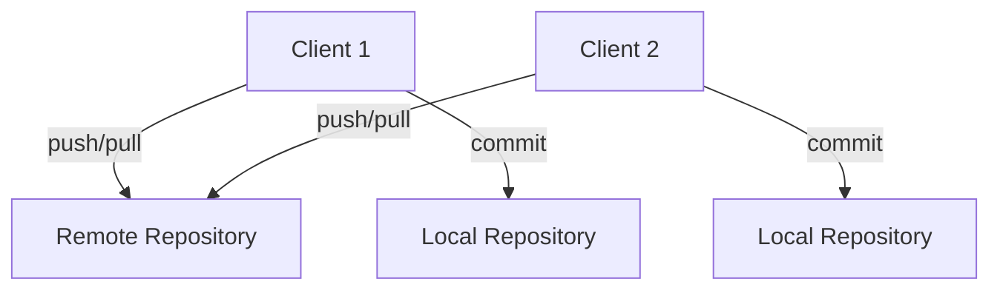

---
layout: two-cols
---

# Why Git?

Selling points:

::left::

<v-clicks>

- Multiple collaborators
  - 4 eyes principle

</v-clicks>

<v-clicks at=4>
<br>

*Joe; I like your change +1*

</v-clicks>

::right::

<div v-click> 

Git is an collaborative development solution that versions your code enabling multiple collaborators and pair-review processes built into the methodology.
</div>


<div v-click> 

```diff
public class Hello1
{
   public static void Main()
   {
-      System.Console.WriteLine("Hello, World!");
+      System.Console.WriteLine("Rock all night long!");
   }
}
```
</div>

<arrow v-click at=5 x1="250" y1="400" x2="550" y2="450" color="#953" width="2" arrowSize="1" />

---
layout: two-cols-header
---

# Why Git?

Selling points:

::left::

<div v-click at=1>

- Change history
  - Compliance
  - Reverting is easy
  - Versioning

</div v-click>

::right::
<div v-click at=2>
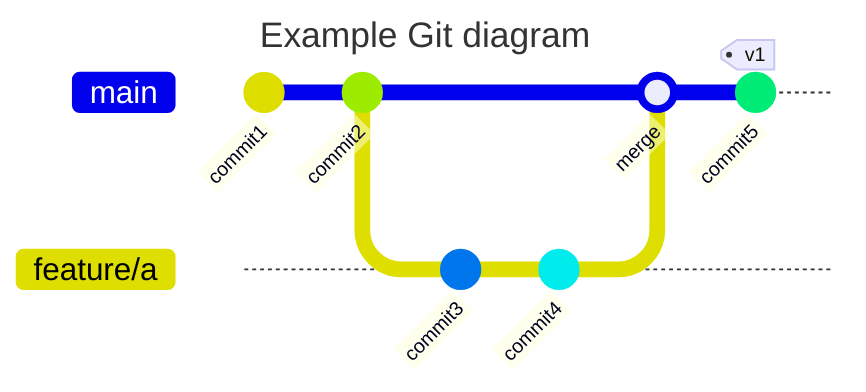
</div v-click>

<div v-click at=3>
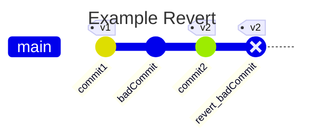
</div v-click>

---
layout:  two-cols-header
---

# Why Git

Selling points:

::left::

<div v-click at=1>

- Automation
  - Quality check
  - Deployment

</div v-click>


::right::

<v-click>

Another benefit of Git is that we can integrate the version control with <span v-mark.circle.orange="3">automation tooling</span> which continuously <span v-mark.circle.red="4">quality checks</span> your code.

</v-click>

<v-click at=5>
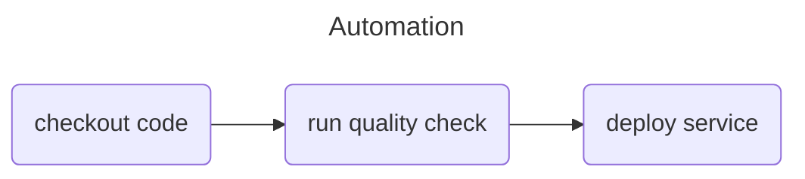
</v-click>

---

# Git: Branches - introduction

Git _branches_ is a requirement of git. _Branches_ are effectively a pointer to a snapshot of your changes, they keep track of increments in commits, and you have multiple long or short-lived _branches_ where when you combine branches with a `merge`, the origin of the _from_ branch can be deleted.

Useful commands:

* `git branch -a` - will display all available branches both remote and local
* `git branch name` - will create _name_ as a branch
* `git checkout name` - will switch to newly created branch _name_
* `git checkout -b featurebranch` - will create branch _featurebranch_ and switch to it, all in one command.

---

# Git: Branches - video

<br>
<br>

<div align="center"><iframe width="560" height="315" src="https://www.youtube.com/embed/hwP7WQkmECE?si=klWPkP_ihdEghSNk&amp;start=68" title="YouTube video player" frameborder="0" allow="accelerometer; autoplay; clipboard-write; encrypted-media; gyroscope; picture-in-picture; web-share" referrerpolicy="strict-origin-when-cross-origin" allowfullscreen></iframe></div>

---

# Git: Branches

Branches in git is the foundation for encapsuling commits in a historic manner. Branches are made for merging in relation to a _base_ branch often named as _main_ or _master_. In the following text we assume _main_, as the default branch.

When a change has been completed on a branch it is ready to be included in _main_. Combining two branches is referred to a *merging*. 
Before we dive into *how* to do it, it is important to talk about *when*. 

Ideally are branches short lived.
This means that we should strive to get meaningful changes merged back into _main_ as quickly as possible.
A good rule of thumb is that branches should not live for more than two days.
In reality, this can be difficult to always do, but it is a good compass, none the less. 

Following our previous branch we can now go back to main

<v-switch>
<template #1>

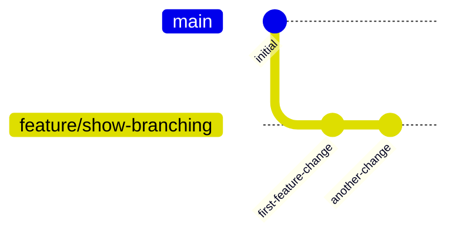
 </template>
<template #2>
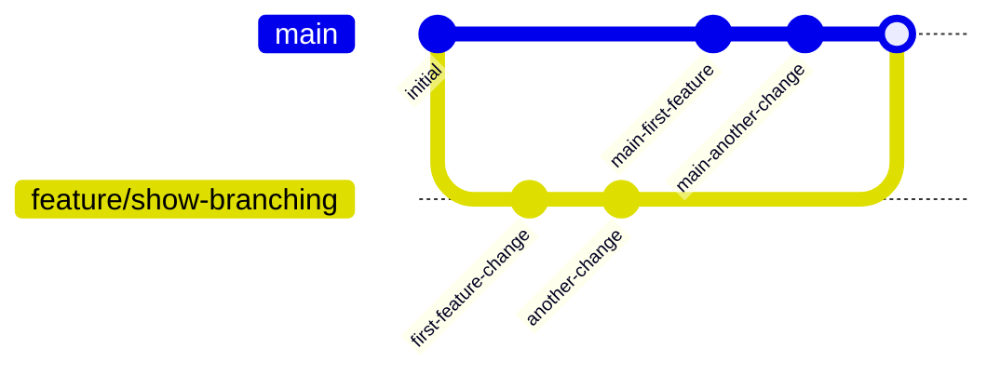
 </template>
</v-switch>

---

# Git: Branches - recap

In previous sections you learned about git _branches_, which to git is the basis for simultaneous work done safely on the same code base. It can be used to do increments on repositories and then `merge` your branch into other branches in order to synchronize your changes with other peers.

The most notable commands to remember from branches are:

* `git branch -r`
* `git checkout <branch-name>`
* `git checkout -b <branch-name>`

---

# Git: Merge / rebase - introduction

Git `merge` or `rebase` is an operation of combining the content of two branches. It is mostly used locally when you branch out of your _main_ branch and want to `merge` _main_ into your feature branch in order to get the latest revision of changes from main. A `merge` is also used when going from a feature branch to _main_ but this is often facilitated by a _Pull-Request_ which we will go over in later chapters.

Useful commands:

* `git merge origin/main` - when a feature branch is checked out, then this command will merge the current _local_ changes of main into your current checked out branch.
* `git pull origin/main` - this is a combination command that will first pull changes from `origin main` and then merge these changes to your current checked out branch.
* `git rebase origin/main` - this will do a rebase of current branch based on `origin main`.
* [Git merge strategies](https://git-scm.com/docs/merge-strategies) - this docs, which can also be read with `man git merge`, explains different merge strategies that can be applied to `git merge`.

---

# Git: Merge / rebase - video

<br>
<br>

<div align="center"><iframe width="560" height="315" src="https://www.youtube.com/embed/0chZFIZLR_0?si=wXEsqrpC528IVvkj" title="YouTube video player" frameborder="0" allow="accelerometer; autoplay; clipboard-write; encrypted-media; gyroscope; picture-in-picture; web-share" referrerpolicy="strict-origin-when-cross-origin" allowfullscreen></iframe></div>

---

# Git: Merge / rebasing - strategy

A merge/rebase is the operation that happens when git combines two branches. These also happen locally, usually in order to synchronize a feature branch with changes from main.

With merges and rebase you have multiple options notated as _strategy_ in documentation about how to go about doing a merge og a rebase.

<v-switch>

<template #1>
There exists different methods of completing a Pull-Request;

1. No fast-forward
1. Fast-forward
1. Squash commit
1. Rebase with fast-forward or merge commit

</template>

<template #2>

**No fast-forward** is the method of not rewriting history and simply adding on top of the target branch.

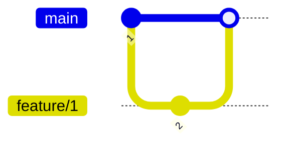

</template>

<template #3>

**Fast-forward** is the method of rewriting target branch to represent a linear history of events. In below graph you see a merge where the merged point is highlighted and represent a duplicate of the commit with id 2 that happened on the feature branch. If a git log is correctly drawn after the impact of the merge, the branch `feature/implement` will no longer be present in the git history.

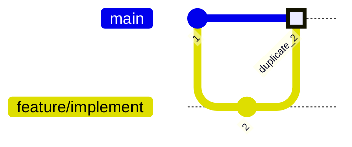

</template>

<template #4>

**Squash commit** is the method of squashing all your commits that happened on the feature branch to a single commit on the target. This method is much like fast-forward in the sense that the existence of the feature branch will be gone in relation to the history after the merge is complete. This method creates a very clean linear git history.


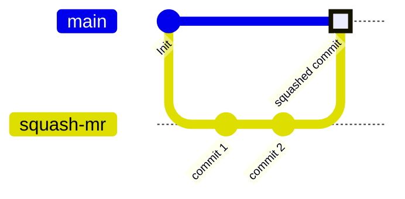

</template>

<template #5>

**Rebase** A rebase strategy works a in a sense reverse to how regular merges does. Instead of adding on top of the target branch, rebase takes each commit on the feature branch and merges one by one with the differences that happened on main since the feature branch got created.

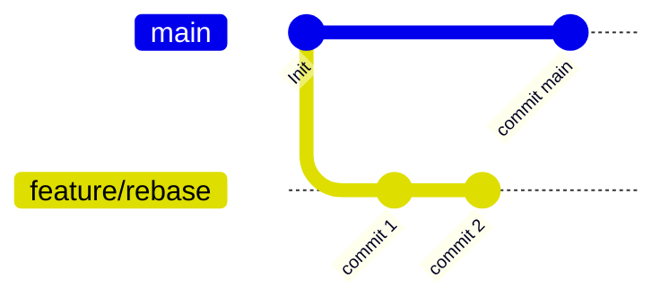

</template>

<template #6>
Rebase
<br>

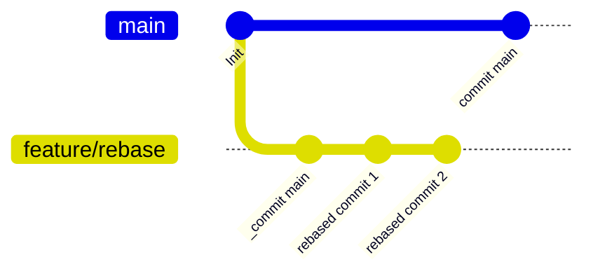

</template>

<template #7>
Rebase and merge
<br>

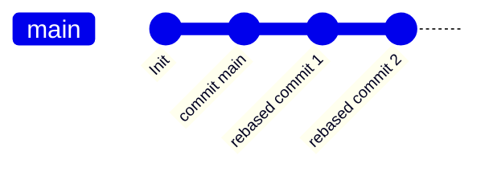

</template>

<template #8>

For more information on read the following topics;

1. [Merging vs Rebasing](https://www.atlassian.com/git/tutorials/merging-vs-rebasing#:~:text=Integrating%20an%20approved%20feature&text=However%2C%20by%20performing%20a%20rebase,added%20during%20a%20pull%20request.)
1. [Git merge](https://www.atlassian.com/git/tutorials/using-branches/git-merge)

</template>

</v-switch>

---

# Git: Merge / rebase - rule of thumb

You can use the same methods as mentioned above locally, however there are a few rule-of-thumb's that we want to introduces:


<v-switch>

<template #1>

**merge with fast-forward**<br>
Pull newest changes of main into your feature branch with fast-forward strategy. This is the safest and cleanest method next to rebase

```bash{2}
git checkout feature/branch
git pull origin main --ff
```

</template>

<template #2>

**rebase**<br>
Pull newest changes of main into your feature branch with rebase strategy. You can use this in-case fast-forward fails or you need to be more in control wil merge conflicts

```bash{2}
git checkout feature/branch
git pull origin main --rebase
```

</template>

<template #3>

**merge with merge commit**<br>
Pull newest changes of main into your feature branch with. You can use this in-case fast-forward fails or you need to be more in control wil merge conflicts

```bash{3}
git checkout feature/branch
git fetch main
git merge origin/main
```

</template>

</v-switch>

---

# Git: Merge / rebasing - recap

In previous section you learned about git `merge` and `rebase` which are both methods of combining content between two branches. They are similar in usage, but function differently in how the history will turn out for the two operations. We use `merge` or `rebase` locally when we want to pull new changes from _main_ into our feature branch or when we want to combine two local branches.

The most notable commands to remember are:

* `git merge`
* `git rebase`
* `git pull origin main`

---

# Git: Merge conflicts - introduction

_Merge conflicts_ are a concept in git that exists due to it by nature is a version control tool, that allows simultaneous client that can change the same files, sometimes on the same line-number, and if they then try and merge with eachother or both towards _main_ they will experience the concept of _merge conflicts_. The existence of merge conflicts are due to the server not knowing which changes on the same line-number should be the truth, or if both has the be truth - so you as a client have to help it make that decision by _fixing the merge conflict_.

There are not really any useful commands for when you need to handle a merge conflict, but there is one general recommendation;

* _Make use of an IDE to help you represent a merge conflict_. By default git will create a syntax highligting consisting of `>` and `<` characters to notate the two decision points on any given line/lines that represents the merge conflict. Making sense of these notations can be hard without a vision representation on top, such as vscode, Visual Studio, Idea IDE, Rider etc.

---

# Git: Merge conflict - video

<br>
<br>

<div align="center"><iframe width="560" height="315" src="https://www.youtube.com/embed/Sqsz1-o7nXk?si=-vQfv2kamrGYfnf4&amp;start=68" title="YouTube video player" frameborder="0" allow="accelerometer; autoplay; clipboard-write; encrypted-media; gyroscope; picture-in-picture; web-share" referrerpolicy="strict-origin-when-cross-origin" allowfullscreen></iframe></div>

---

# Git: Merge conflicts

When you are more than one participant on a git repository, then you will at some point run into a merge conflict. <br>

<v-switch>

<template #1>

Think of a scenario where you and a colleague both created a branch from main:

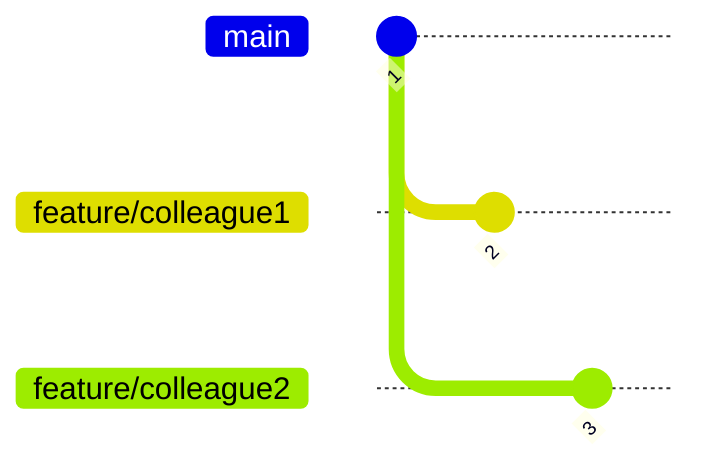

</template>

<template #2>

You both edited the same file _text.txt_ on the same line 1:

(colleague1)
```diff

+echo "hello colleague1"

```

(colleague2)
```diff

+echo "hello colleague2"

```

</template>

</v-switch>

---

# Git: Merge conflicts

When you are more than one participant on a git repository, then you will at some point run into a merge conflict. <br>

This will result in a conflict where both colleague1 and colleague2 have changed the exact same line on the exact same file;

```diff {all|3|5|all}
@@@ -1,1 -1,1 +1,5 @@@
++<<<<<<< HEAD
+echo "hello colleague1"
++=======
+ +echo "hello colleague2"
++>>>>>>> feature/colleague2
```

The diff is noted with all the special characters you in one block has what current revision marks as the "truth" and another block marks the incoming change as possible new "truth". Merge conflicts can happen both when doing local merge/rebase or when you open a PR. Often times the git server cannot handle merge conflicts for you, so you are required to do it locally.

Merge conflicts can be handled "easily" in your favorite IDE.

---

# Git: Merge conflicts - recap

In previous section you learned about _merge conflicts_ in git. Merge conflicts is when git does not know the truth about how to handle two changes in the same file on the same line. The conflict is always a result of either a `merge` with another branch that contains edits on the same line in the same file as you have on your current branch.

The key takeaway of this section is that _merge conflicts_ can be a pain to work with, but is necessary for git to have as a concept, and without a UI tool, merge conflicts can be challenging to deal with.

---

# Git: Revert / reset - introduction

Git `revert` or `reset` function differently, but they are often used with the same basic need; undoing something committed and/or pushed to origin. `Revert` works on a single or multiple commits that you want to reverse. `Reset` works on a single or multiple commits/staged changes that you want to unstage/uncommit in order to either reverse them or change in order to stage/commit again.

Useful commands:

* `git reset HEAD~1` - will reset the current changes with the one commit happened on `HEAD` of the branch. The changes will end up unstaged
* `git reset --soft HEAD~1` - the `--soft` adds that the changes will be staged instead of unstaged
* `git reset --hard HEAD~1` - the `--hard` adds that the changes will be completely undone.
* `git revert <commit-id>` - will create a new commit reverting the content of commit id you put into `<commit-id>`.

---

# Git: Revert / reset - video

<br>
<br>

<div align="center"><iframe width="560" height="315" src="https://www.youtube.com/embed/H2DuJNWbqLw?si=Ltw_X87fbonFOsqe" title="YouTube video player" frameborder="0" allow="accelerometer; autoplay; clipboard-write; encrypted-media; gyroscope; picture-in-picture; web-share" referrerpolicy="strict-origin-when-cross-origin" allowfullscreen></iframe></div>

---

# Git: Revert / Reset

You can end up in a situation where you find yourself in a detached head state or you simply committed to the wrong branch or similar. This is where [git revert](https://git-scm.com/docs/git-revert) or [git reset](https://git-scm.com/docs/git-reset) comes in handy.

<v-switch>

<template #1>

Lets say you ended up in a situation where you did not want to have committed the files anyway.

```diff

echo "hello world"
+ echo "I did not want this change to be in the file
```

</template>

<template #2>

Your git status says that you have one change yet to be synced:

```{2}
On branch feature/merge_strategies
Your branch is ahead of 'origin/feature/merge_strategies' by 1 commit.
  (use "git push" to publish your local commits)

nothing to commit, working tree clean
```

</template>

<template #3>

Then using git reset can help you get back to a point where you can edit the commit once again or scratch the commit entirely.

```bash
git reset --soft <commitid>
git reset --hard <commitid>
```

<br>

```bash
git reset --soft HEAD~1 # This will undo the latest commit happened on the current branch. 
  # --soft will make it so the edit is still changed and staged but not committed
```

<br>

```bash
git reset --hard HEAD~1 # This will undo the latest commit happened on the current branch. 
# --hard will make it so the edit of the commit is nowhere to be found anymore.
```

</template>

<template #4>

If you find yourself having committed and pushed the changes to a branch and you want to undo commit, then reset can be used, but it will be much cleaner to do a revert:

```bash
git revert <commitid>
```

<br>

```bash
git revert HEAD~1 # This will create a new commit undoing all changes from the latest commit on the branch
```

The main difference between revert and reset is that revert is for undoing changes with a new commit, whereas reset is mostly used before changes are synced with origin

</template>

</v-switch>

---

# Git: Revert / Reset - recap

In previous section you learned about git `revert` and `reset`, which both are two commands for undoing work in git. `Revert` will undo commit(s) by creating a new commit with the undoing of the changes, while `reset` will "uncommit" or entirely erase committed changes based on strategy.

The most notable commands to remember are:

* `git reset --soft/hard <commit-id>/HEAD~<index>`
* `git revert <commit-id>/HEAD~<index>`

---

# Git: Stash - introduction

Git `stash` is a command that can help you save work that you unintentionally put on the wrong branch. When you have made changes to files while having checked out the wrong branch, and you then want to transfer said changes to a correct target branch, then git will prohibit you from simply checkout out said branch. This is where `git stash` comes in handy, since you by this can save work in a queue, checkout the correct target branch and `pop` the changes out of the queue thereby onto the current target branch.

Useful commands:

* `git stash --include-untracked` - will stash the current staged, unstaged and untracked files into the `stash`
* `git stash pop` - will remove the latest changes added to `stash` and add them to the current checked out branch
* `git stash list` - will show the items in the current `stash` queue

---

# Git: Stash - video

<br>
<br>

<div align="center"><iframe width="560" height="315" src="https://www.youtube.com/embed/lH3ZkwbVp5E?si=z4V07VS_zoSn5Qb0" title="YouTube video player" frameborder="0" allow="accelerometer; autoplay; clipboard-write; encrypted-media; gyroscope; picture-in-picture; web-share" referrerpolicy="strict-origin-when-cross-origin" allowfullscreen></iframe></div>

---

# Git: Stash

Git stashing is the method of saving your unstaged work for a later point. Often it can be used to save work in order to do a `git pull` or if you made changes on a branch that should not have been done from that revision.

Git stash works as a LIFO queue (last in - first out), where if you run `git stash push` then an entry is put into the cue with the current stages and unstaged changes. If you then run `git stash pop` then the edits you just put int op the queue are "popped" from the queue and the edits are present again.

```bash
git stash list # will list the current queue of stashed entries
git stash # will push current edits into a stash entry for the queue
git stash list # Should now have a single entry in it
git stash pop # will remove the entry from the queue and apply the edits again in the local repo
```

---

# Git: Stash - recap

In previous section you learned about git `stash` which is a queue that can contain changes without being tied to a branch. Git `stash` is useful for saving and moving work that was unintentional made on a branch where it shouldn't have been made. Git `stash` works as a LIFO queue, meaning when you add something to the queue it will be the top item in the queue, and thereby the first being removed from the queue upon `pop`.

The most notable commands to remember are:

* `git stash`
* `git stash pop`

---

# Git: Push / Pull - introduction

Git `push` or `pull` are operations that respectively push or pull synchronize commits to/with origin for a given branch or all branches. With `git push` you add your local changes to a remote repository, and with `git pull` you fetch and include remote changes into your branch.

Useful commands:

* `git push origin` - will push changes to origin for the current checked out branch
* `git pull origin` - will pull changes from origin for the current checked out branch

---

# Git: Push / Pull - video

404 not found

---

# Git: Push / Pull - recap

In previous section your learned about `git push` and `git pull` which are two commands that relatively synchronize local changes to origin and synchronize origin with your local state. 
Git has the notion of a _repository_, to which a user of the repository can synchronize its changes to and the user can `pull` other people changes from.
It is often best practice to when you have something that is working, and at least once a day, to push your changes with origin.

The most notable commands to remember are:

* `git push`
* `git pull`
* `git fetch`

---

# Git: Pull-Request - introduction

A git _Pull-Request_ is a server side operation of facilitating a merge between two branches. A _Pull-Request_ differs a lot servers between, but generally they all contain functionality like;

* Viewing diff view of changes _from_ branch _to_ branch
* _Assignee_ and _Reviewer_
* Comment threads
* Approvals, rejections and suggestions
* Merge with support for different strategies

---

# Git: Pull-Request - video

404 not found

---

# Git: Pull-Request

404 not found

---

# Git: Pull-Request - recap

In previous section you learned about Pull-Requests for git, which is a server-side technology that facilitates a merge between two branches.
A Pull-Request is the foundation of collaboration for git, since it is the place where you can raise awareness of your edits and get input on them.

With a Pull-Request you get functionality like;
* _assignee_ & _reviewers_
* _commit threads_
* _approvals/rejections/suggestions_
* and more.

---

# Time to do exercises!


- In the repo; https://github.com/mftenergy/Gitting-comfortable there are exercises
- Follow the path explained at https://github.com/mftenergy/Gitting-comfortable?tab=readme-ov-file#suggested-learning-path
- Path into an exercise directory, run `setup.sh` and read the README.md for instruction on what to do

```bash
cd basic-commits
./setup.sh
cat README.md
git magic
```

NOTE: There is a [cheatsheet](https://github.com/mftenergy/Gitting-comfortable?tab=readme-ov-file#cheatsheet) at the bottom of the README.md in the root of the repository.

You have two option;

1. **recommended** [Run in google cloud spaces (free)](https://console.cloud.google.com/cloudshell/editor?cloudshell_git_repo=https://github.com/mftenergy/git-course.git)
1. Run everything locally, if you choose that then read: [https://github.com/mftenergy/Gitting-comfortable/blob/main/setup-git/README.md](setup-git)
